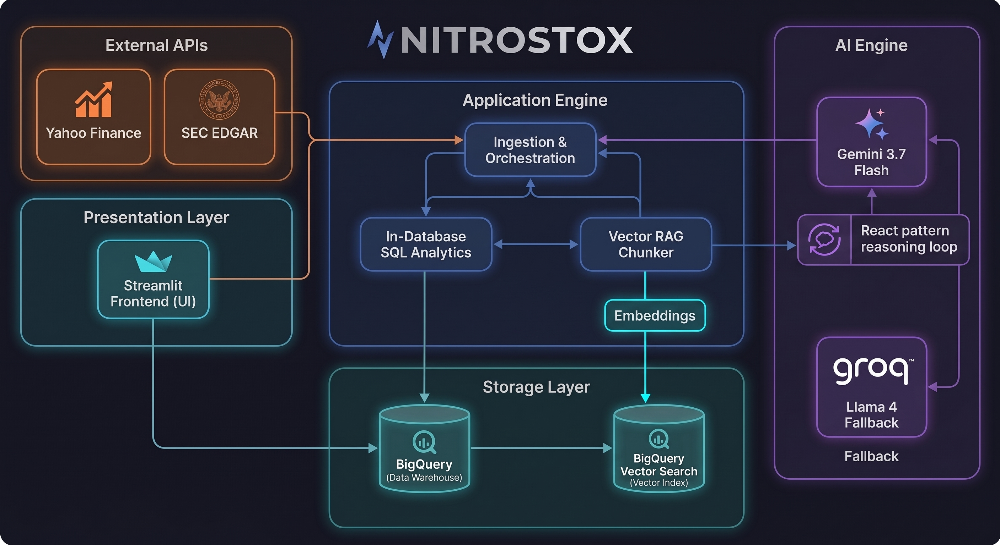

# 📈 NitroStox: NYSE Financial Intelligence Platform


**NitroStox** is a technical financial intelligence platform powered by an **automated ELT pipeline**. Built directly on **Google Cloud BigQuery**, it unifies raw market data, breaking news, SEC filings, and algorithmic trading signals into a single analytics dashboard. The engine delivers **in-warehouse SQL window transformations**, **multi-threaded parallel ingestion**, and **semantic similarity search** across SEC filings using in-memory NumPy cosine similarity.


> [!WARNING]
> **Not investment advice.** NitroStox is an educational portfolio project, not a financial product. Its signals, sentiment reads, and filing summaries come from fixed rules and an AI model and are provided for information only. They are not investment, financial, tax, or legal advice, and not a recommendation to buy or sell any security. Market data comes from public sources (Yahoo Finance and SEC EDGAR) and may be delayed, incomplete, or wrong, and AI output can contain errors (see the Evaluation and Known Limitations sections). Do your own research and consult a licensed financial advisor before making any investment decision. The author is not a licensed financial advisor and accepts no liability for decisions made using this tool.

---

## 💼 Business Value: Market Synthesis in One Dashboard

Built for data-driven traders, retail investors, and analytics engineers leveraging the modern cloud data stack.

* **Buy-Side Earnings Audits (Thematic RAG):** Runs three parallel thematic similarity searches (outlook and guidance; margins and costs; strategy, macro, and red flags) over the latest **SEC filing** (10-Q, with fallbacks) to surface management guidance shifts, margin compression, and accounting red flags. The audit follows a **5-pillar framework** (Future Guidance; Profit Margins & Cost Pressures; Management's Discussion (MD&A); Strategic Shifts & Macro; Red Flags & Risks). The model is instructed to ground the audit exclusively in the retrieved filing text and recent earnings news, and to answer "Insufficient data in available text" for any pillar the text does not support.
* **Live Insider Activity:** Retrieves the five most recent **Form 4 filings** live from SEC EDGAR and reports net insider buying and selling to surface executive accumulation and distribution activity.
* **Multi-Source Sentiment Synthesis:** **Gemini 3.7 Flash** combines recent price and volume, news headlines, insider activity, and dividend yield and payout ratio into a short BULLISH / BEARISH / NEUTRAL read.
* **Algorithmic Signal Classification:** Replaces subjective charting with rule-based signals computed in BigQuery SQL from moving-average crossovers, volume, RSI, and Z-scores. The breakout and reversal rule depends on the company's sector (for example **`TECH BREAKOUT`** for Technology, **`CAPITULATION BUY`** for Utilities).
* **Dividend Profiling:** Shows dividend yield, payout ratio, and payment history, and flags payout ratios above 100% as high risk.

---

## 🏗️ Technical & Architectural Pillars

<p align="center">
  
</p>

* **Autonomous Function Calling (ReAct Loop):** **Gemini 3.7 Flash** autonomously evaluates user prompts, determines missing context, and calls three Python tools: a semantic search over in-memory SEC 10-Q chunks, a BigQuery window-function indicator lookup, and a BigQuery watchlist manager (add/remove tickers). Tool calls reuse the dashboard's loaded data and cached filing vectors.
* **Advanced In-Database SQL Analytics (ELT):** Offloads complex technical indicator math (Wilder's RSI, Moving Averages, Z-Scores) entirely to BigQuery. Uses chained **Common Table Expressions (CTEs)** and **Window Functions** (`LAG`, `AVG`/`MAX`/`SUM OVER`, `SQRT`).
* **In-Memory Semantic Vector RAG:** Splits the latest SEC filing (10-Q, with 10-K/20-F/6-K fallbacks) using a custom Python chunker (2,000-character chunks, 300-character overlap), embeds the chunks with `gemini-embedding-001` in batches of 20 (exponential backoff on quota errors; search queries are LRU-cached), and ranks chunks by cosine similarity using **NumPy** in application memory. The vector index is built on demand, cached in memory per ticker for 24 hours, and not stored in BigQuery.
* **Interactive Filing Search & Agent Chat:** The dashboard includes a search box that returns the top three matching filing chunks with their similarity scores, and a chat agent that remembers the last six messages.
* **Parallel Ingestion:** Uses Python's `ThreadPoolExecutor` to fetch market data, dividend metrics, and SEC insider trades concurrently, then runs the dependent BigQuery reads (price chart, dividends, indicators) in parallel once the data load completes.
* **Stateful UI Caching & Cost Management:** Uses **Streamlit** `@st.cache_data` (1-hour TTL on AI results), per-session storage of each computed analysis, and a 24-hour filing-vector cache, so widget interactions don't re-query BigQuery, Yahoo Finance, or SEC EDGAR or repeat LLM calls. The filing search and agent chat run as Streamlit fragments, so they rerun independently of the dashboard.

## 🎯 Automated Trade Signals

Signals are classified in BigQuery SQL. Rules are evaluated top to bottom and the first match wins. The sector-specific rules come first and depend on the company's sector (from Yahoo Finance); the rest are shared.

| Signal | Applies to | Engine Logic & Market Context |
| :--- | :--- | :--- |
| ⚡ **CAPITULATION BUY** | Utilities, Consumer Defensive | **Oversold reversal.** `Z_Score < -2.0`, volume above 1.5x its 20-day average, and a positive price change. |
| ⚠️ **EXHAUSTED SELL** | Utilities, Consumer Defensive | **Overextended.** `Z_Score > 2.0` and `RSI_14 > 70`. |
| 🚀 **TECH BREAKOUT** | Technology, Consumer Cyclical | **Volume-backed momentum.** `MA_7 > MA_60`, `Close >= Local_High_20_day`, volume above 1.5x its 20-day average, and `RSI_14 < 70`. |
| 🚀 **HIGH CONVICTION BUY** | Sectors not listed above | **Volume-backed momentum.** Same conditions as TECH BREAKOUT. |
| ⚠️ **WEAK BREAKOUT (Check Vol/RSI)** | All sectors | **Unconfirmed momentum.** `MA_7 > MA_60` and `Close > Local_High_20_day`, but the volume or RSI conditions above are not met. Utilities and Consumer Defensive have no volume-backed breakout rule, so any such breakout gets this label. |
| ⚠️ **FLASH BREAKDOWN** | All sectors | **Sharp dip / temporary noise.** Price pierces the 60-day baseline (`Close < MA_60_day`) while fast momentum (`MA_7 > MA_60`) remains intact. |
| ⚠️ **BREAKDOWN** | All sectors | **Structural failure.** Both price and fast momentum breach the baseline (`MA_7 < MA_60` and `Close < MA_60`). |
| 📉 **PULLBACK** | All sectors | **Tactical retracement.** Macro trend holds (`MA_7 > MA_60` and `Close >= MA_60`), but price dips below fast support (`Close < MA_7_day`). |
| 🟢 **UPTREND** | All sectors | **Confirmed trend.** Price holds above fast support (`Close >= MA_7_day`) while `MA_7 > MA_60`. |
| 🟡 **RELIEF RALLY** | All sectors | **Counter-trend bounce.** `MA_7 < MA_60`, but price rebounds above the fast average (`Close > MA_7_day`). |
| 🔴 **DOWNTREND** | All sectors | **Capital preservation.** `MA_7 < MA_60` and price stays at or below the fast average (`Close <= MA_7_day`). |
| ⚪ **NEUTRAL** | All sectors | **Consolidation.** No rule above matches; no definitive edge. |

*Signals are rule-based technical indicators for information only. Labels such as BUY or SELL are not recommendations (see the disclaimer at the top).*

## 🧪 Evaluation (Baseline)

A small harness measures how well the filing search and chat agent answer questions about a real SEC filing. It is a baseline: one filing, 20 questions.

**Setup**
* **Filing:** Amazon's 10-Q for the quarter ended June 30, 2026 (`filing_AMZN.txt`, saved once so every run uses the same text).
* **Questions:** 20 in `eval_questions_AMZN.json`: 14 answered in the filing, 6 deliberately not (for example CEO pay, competitor share, revenue two years ago). Each answerable question has an expected answer and an exact evidence phrase, written from the filing text before looking at the app's output.
* **Retrieval test:** does a top-5 chunk contain the evidence phrase? *Strict* accepts the primary phrase only; *lenient* also accepts alternates that answer equally well (some added after the first run).
* **Agent test:** each question goes through the function the chat box calls, twice, on the saved filing. The script logs whether the agent searched the filing, and I graded every answer: correct, partial, wrong, or (for out-of-filing questions) refused vs. answered anyway.

**Results**

| Measure | Result |
| :--- | :--- |
| Retrieval, question text as the query (14 answerable questions) | Strict **6/14** in the top 5; lenient **12/14** |
| Agent answers on answerable questions (14 questions × 2 runs = 28) | **20 correct, 6 partial, 2 wrong** |
| Agent searched the filing and retrieved the evidence | 12 of 14 answerable questions |
| Questions not in the filing (5 scored × 2 runs = 10 answers) | **2 clean refusals**, 8 answered with outside or derived information |
| Run-to-run consistency | Same grade for every question in both runs |

The stock-price question is excluded from the refusal count because the app's price tool can legitimately answer it. Batched embeddings did not change retrieval: all 20 questions returned the same top-5 chunks before and after.

**What the evaluation found**
1. **A confident wrong answer from a table.** Both runs reported Q2 2025 net income ($18.2B) as the current quarter (correct: $62.6B), plus that year's EPS and operating income. The chunk holding the row starts mid-table with no column headers, so the model guessed the column order.
2. **The chat agent is not restricted to the filing.** Its prompt has no answer-only-from-filings rule (only the 5-pillar audit prompt does). On out-of-filing questions it gave CEO pay, competitor market shares, and a two-years-ago revenue figure from outside knowledge; the market-share numbers differed between runs.
3. **Partial answers.** It missed management's "sufficient for at least the next twelve months" liquidity statement, the $640M IEEPA tariff refunds, and two of the three Part II litigation matters.
4. **What worked.** Guidance, EPS, cash, segment growth, repurchases, and accounting-standards questions were correct; spot-checked figures were in the filing text.

**Caveats:** one filing, 20 questions, two runs, and one grader, so the numbers show direction, not precision. The answer key was extracted from the filing text and spot-checked by hand; building it exposed one error in the key (a guidance question first marked not answerable), which I corrected. The 5-pillar audit, technical signals, and Form 4 features were not evaluated.

**Run it** (from `src/`, with `GEMINI_API_KEY` in `.env`):
```bash
python save_filing.py                  # saves filing_<TICKER>.txt
python run_eval.py                     # retrieval test only
python run_eval.py --agent --runs 2    # also asks the agent every question (needs the app's GCP credentials)
```
Results go to `eval_results_<date>.csv`; the graded baseline is `eval_results_20261004_1701_graded.csv`.

## ⚠️ Known Limitations

* **The chat agent is not grounded in the filing** (evaluation finding 2).
* **Tables lose their column headers** when fixed-size chunks cut them off (evaluation finding 1).
* **The text version of the filing drops some table cells.** For example, the income statement row for other operating expense is missing its Q2 2026 value.
* **Refusals are prompt-enforced.** "Insufficient data in available text" in the 5-pillar audit is an instruction to the model, not a code-level check, and search always returns the top results with no similarity cutoff.
* **Fixed-size chunking.** Chunks ignore section boundaries, so a passage can be split across two chunks.
* **Three thematic queries.** The 5-pillar audit retrieves with three themes, so the MD&A pillar has no dedicated query.
* **In-memory index.** Built for one filing at a time and cached in memory for 24 hours (lost on restart); not designed for a large corpus.
* **Latest filing only.** The audit uses the most recent filing found, so results change as new filings appear.
* **Errors are cached.** AI responses are cached for an hour as returned, so a transient Gemini error can persist until the cache expires.
* **No de-duplication of saved results.** Each analysis appends a new row to the results table, even for a ticker already analyzed.

## 🔜 Next Steps

* Restrict the chat agent to retrieved filing text for filing questions, and have it say when something is not in the filing.
* Keep column headers with table chunks so period labels survive chunking.
* Rerun the evaluation and compare against this baseline; add a second company.

---

<details>
<summary><b>📖 The Beginner's Glossary (Click to expand)</b></summary>


If you are new to stock analysis, don't worry. Here is a simple breakdown of the core concepts this tool uses to evaluate the market:

* **Moving Average (MA):** Stock prices jump up and down erratically every day. A Moving Average smooths out that jagged line by calculating the average price over a set number of days. It helps you see the *actual* direction the stock is heading, ignoring the daily noise.
* **The Moving-Average Crossover:** This is a classic bullish (positive) signal. It happens when a short-term moving average (like our 7-day line) crosses *above* a long-term moving average (like our 60-day line). Think of it as a stock suddenly accelerating and overtaking its old speed limit—it tells us **new buyers are rushing in**. (The textbook "golden cross" uses the 50- and 200-day lines; NitroStox uses 7 and 60.)
* **RSI (Relative Strength Index):** Think of this as the stock's speedometer, graded on a scale from 0 to 100.
  * If it goes **above 70**, the stock is considered "Overbought" (running too hot) and is likely due for a cool-down or price drop.
  * If it goes **below 30**, it is "Oversold" and might be a good bargain.
* **Insider Trading (Form 4):** When we say 'insider trading,' we don't mean the illegal kind! When the CEO or President of a company legally buys or sells their own company's stock, they have to file a 'Form 4' with the government. Tracking this tells us if the people running the company are confident in its future.
* **Dividend:** A cash bonus paid by a company directly to its shareholders. If a company makes a profit, they might decide to share a slice of it with you simply for owning their stock. NitroStox helps you track exactly when and how much you get paid.

</details>

<details>
<summary><b>🚀 Setup & Installation Guide (Click to expand)</b></summary>

To run NitroStox locally or deploy it to Google Cloud Platform (GCP), configure your environment with GCP credentials, provision BigQuery access, and comply with SEC automated scraping guidelines.

### 1. Install Dependencies

Provision your environment with the required GCP, data engineering, AI, and UI dependencies:

```bash
pip install yfinance pandas numpy plotly python-dotenv google-genai edgar-tools "streamlit>=1.37" google-cloud-bigquery db-dtypes
```

### 2. Configure Environment Variables

Create a `.env` file in the project's root directory to store your credentials securely. Note that the SEC EDGAR framework strictly requires a declared user agent header (`SEC_IDENTITY`) formatted as an email address:

```env
GCP_PROJECT_ID=your_gcp_project_id
BQ_DATASET=nitrostox_analytics
GOOGLE_APPLICATION_CREDENTIALS=path/to/service_account_key.json
SEC_IDENTITY=your_professional_email@example.com
GEMINI_API_KEY=your_gemini_api_key_here
```

### 3. Execution & Deployment Infrastructure

The application features a decoupled architecture allowing execution as an isolated Python pipeline, a local Streamlit application, or a serverless containerized deployment on Google Cloud Run.

**Option A: Run Standalone Backend Pipeline**
Executes the ingestion sequence, offloads technical indicators to BigQuery SQL window functions, runs LLM sentiment evaluations, and automatically writes the analysis results (sentiment and earnings audit) to BigQuery:
```bash
cd src
python upgraded_nitrostox.py
```

**Option B: Launch Interactive Analytics Dashboard (Local)**
Spins up the Streamlit frontend UI connected directly to BigQuery for persistent watchlist management and visual chart rendering:
```bash
cd src
streamlit run app.py
```

**Option C: Deploy to Google Cloud Run**
Containerize and deploy the application natively to Google Cloud Run:
```bash
# Build the container image via Google Cloud Build
gcloud builds submit --tag gcr.io/$GCP_PROJECT_ID/nitrostox-app

# Deploy to Cloud Run
gcloud run deploy nitrostox-app \
  --image gcr.io/$GCP_PROJECT_ID/nitrostox-app \
  --platform managed \
  --region us-central1 \
  --allow-unauthenticated \
  --set-env-vars GCP_PROJECT_ID=$GCP_PROJECT_ID,BQ_DATASET=$BQ_DATASET,SEC_IDENTITY=$SEC_IDENTITY \
  --set-secrets GEMINI_API_KEY=gemini-api-key:latest
```

</details>
